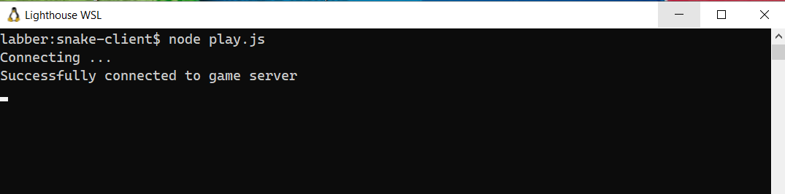
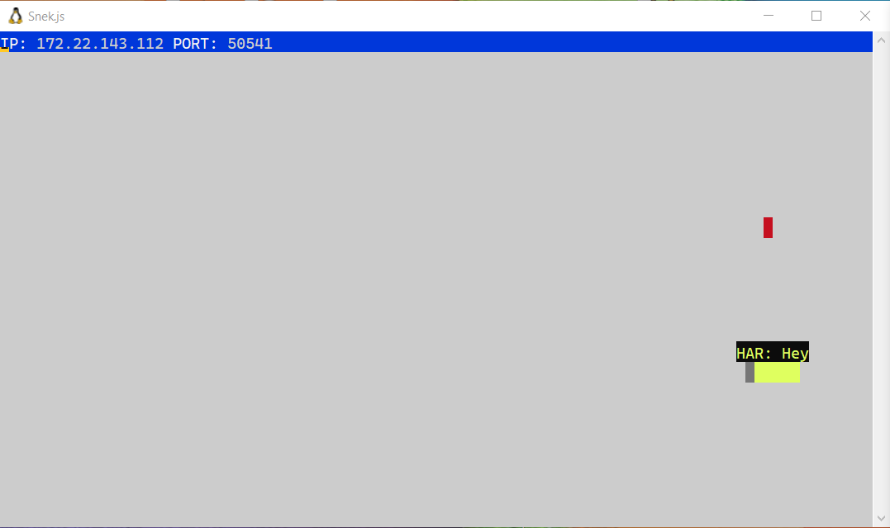
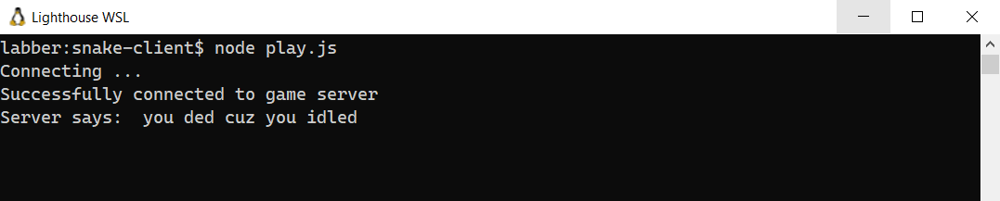
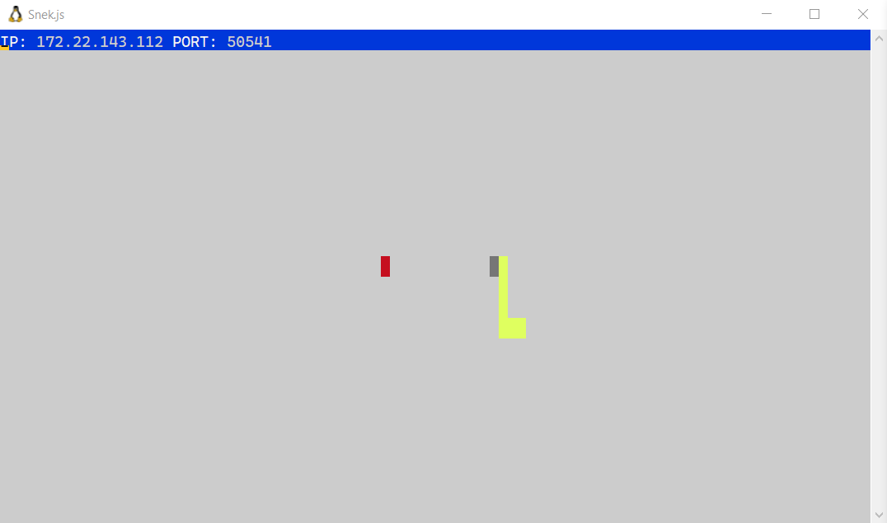
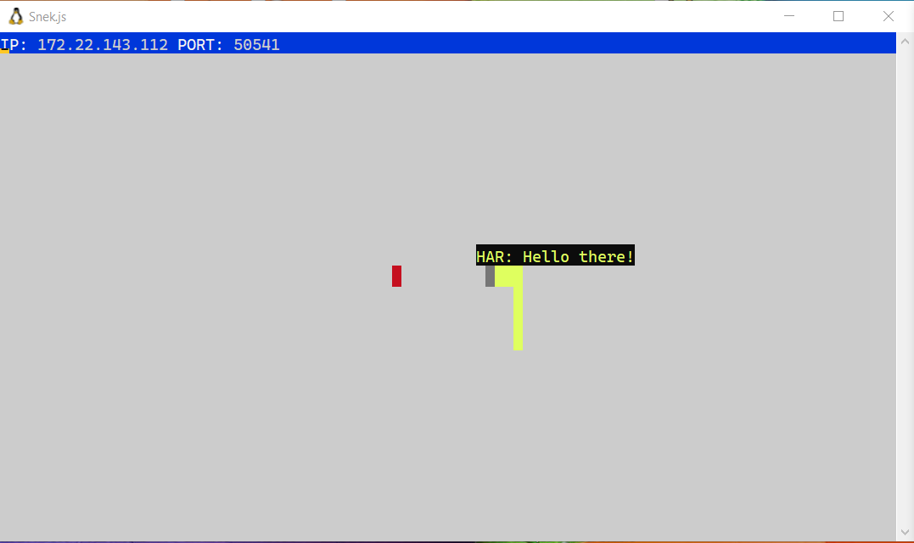

# Snake Client Project

Snake game is a very popular video game. It is a video game concept where the player maneuvers a dot and grows it by ‘eating’ pieces of food. As it moves and eats, it grows and the growing snake becomes an obstacle to smooth maneuvers. The goal is to grow it to become as big as possible without bumping into the side walls, or bumping into itself, upon which it dies.

This is simply a multiplayer take on the genre.

Before you can run this client, you will need to be running the server side which you can download and install from [here](https://github.com/lighthouse-labs/snek-multiplayer). 

## Final Product
- After a connection is established between client and server, we will see a message 'Successfully connected to game server' on a terminal.
  - 

- Upon successful connection, this is how our snake will look on server-side.
  - 

- If we didn't press any movement key, we will get a response from the server-side which is logged on the terminal on client-side.
  - 

- This is how our snake will move upon pressing movement keys `(w a s d)`. 
  - 

- We can send messages. After pressing 1, we can start writing our message. Pressing 0 will send the message.
  - 

## Getting Started

- Follow steps inside the [snek server repo](https://github.com/lighthouse-labs/snek-multiplayer) to run the server side
- Run the development snake client using the `node play.js` command.
- Press `Ctrl C` to exit.